[TOC]

## 序

在 xhp 工作的复盘，时间是 2023 年 2 月 6 日 到 2 月 28 日，因为 2 月时间短，实际只有 3 周。

本来采用 “时间——本周任务——实际做了什么” 的表格记法，但是这种不适用，因为并没有周会，熟练了工作的重点是出差。所以把本周任务换成业务安排，可以有也可能没有。

## 概述 Overview

生活日志 [2023年2月](https://ae85.gitee.io/update/journal/202202xhp)

|     T     | 业务安排 | 实际做了什么                                                 |
| :-------: | -------- | ------------------------------------------------------------ |
| 2.06 - 10 | -        | 参加会议，看演示； 观摩师傅组装采集装置；看了送货全过程； |
| 2.13 - 18 | -        | 组装2U采集单元；组装屏柜                                     |
| 2.20 - 26 | -        | 组装 2U 采集单元；发货                                       |

## 第一周

前两天主要参加工程部会议。介绍配置校验仪；介绍报文软件更新方法（两个下午）；介绍压板新设备和软件。

后两天主要学习安装采集单元，从空机箱开始到放入老化房测试，了解了这个硬件里面的大体结构。

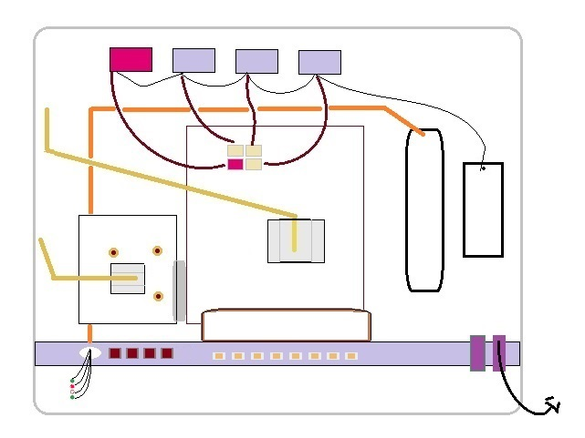

教了制作网线的方法，以及产品送货，装上货车的现场。

没有周会，下班不写日报；打卡可以在园区。

## 第二周

第一天主要组装 2U 的新采集单元，下午还看着他们改装 3U 的采集单元（更换采集板的采集卡和背板）。中间两天，工程部的大家要去苏州考试，都在刷题复习，没什么事。后面一天半开始组屏，学了包括剪线、放端子、打印线签。

给 3U 的采集单元更换采集板，就是为了换背板，把4口千兆的换成百兆8口，需要同时连FPGA卡都换了。它薄一些，因为里面的看FPGA 开发板是新班子，不需要和主板卡槽进去。顺带学会了开关电源连线，测试接口方式，电压表的尝试。

1 铜柱。铜柱分好几种，采集版中间垫散热块的用短的，外部连机箱的用长的。

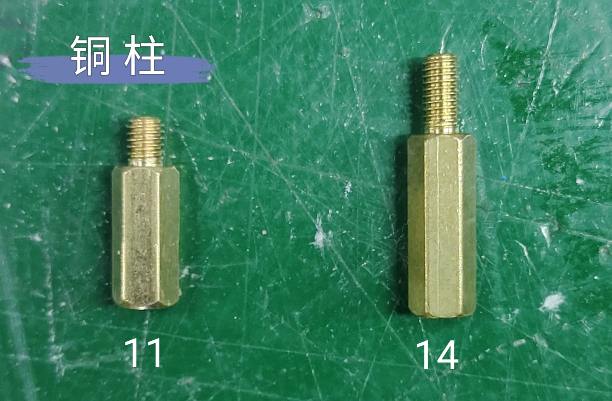

2 开关电源。有直流电一边的5V（红色） 12V（黄色）和 24V（蓝色），交流电一边的接地线黑色，其它两个随便一个接绿色。捋清楚后找后面黄工大姐有铝丝烫。

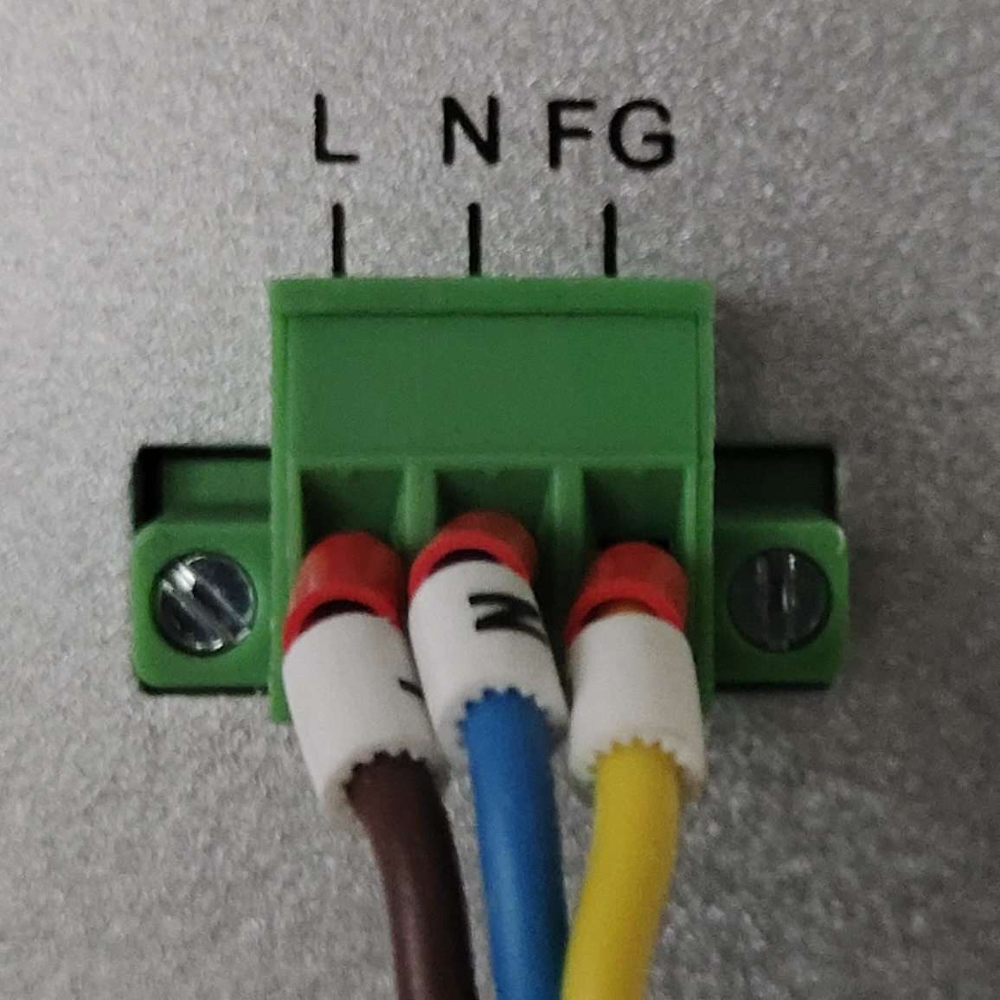

3 测试接口。交换机右边的4个口的线是千兆，其他是百兆。主要拿出来的两根线不能直接分辨左右顺序，需要试着弄。

2U 采集装置的背板上 8 个口，其中 6、8 两个口插千兆，其他口插百兆。就是 6、8 两个插黑的光模块，其他蓝的。 

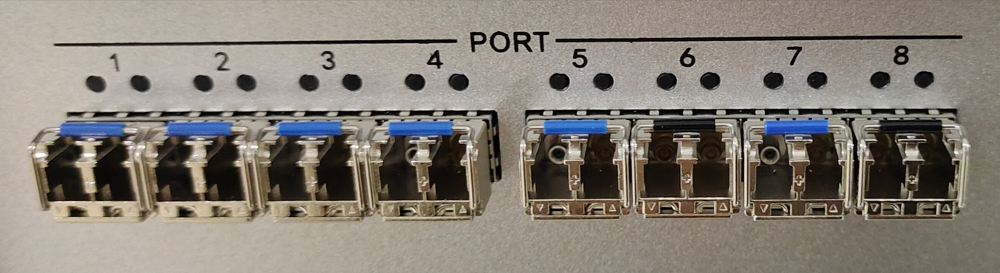

测试时，电线插到哪个口，在后台软件里哪个口对应的灯点就会发绿，后面也会带数据。

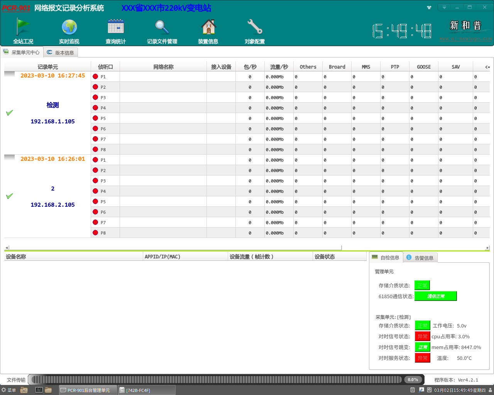

4 电压表。电阻的特性，短路会蜂鸣。开机状态下，如果机器没问题，是故障口不响，告警口响；关掉电源了就是告警口不响，故障口响。

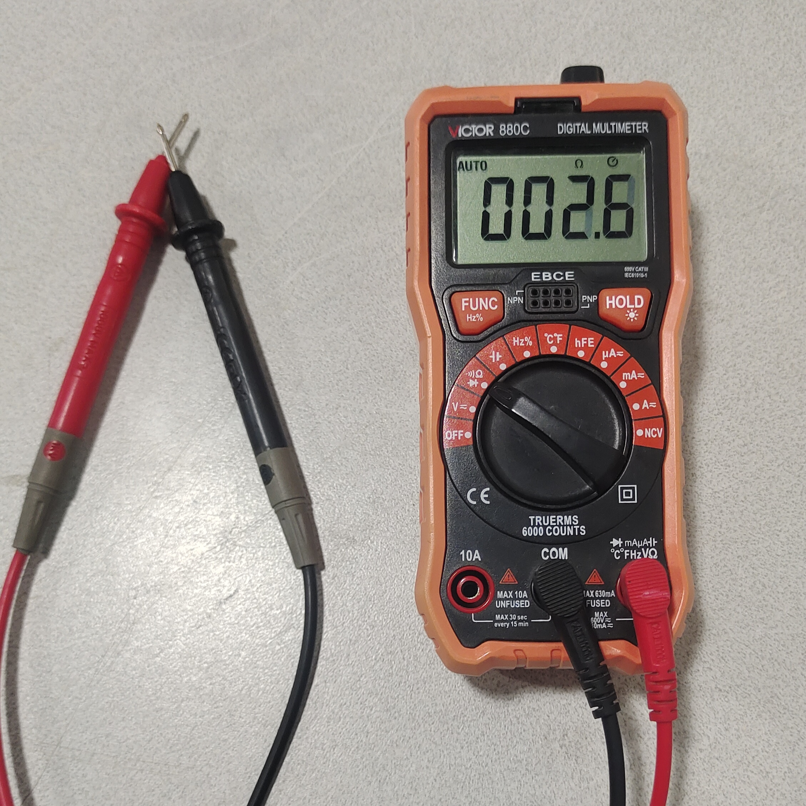

组屏包括剪线、放端子、打印线签。

- 配端子

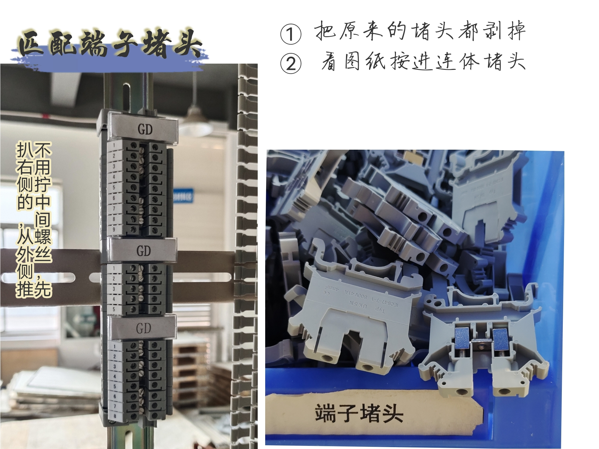

端子的用途，就是转好了能转个弯，加入开关控制器。

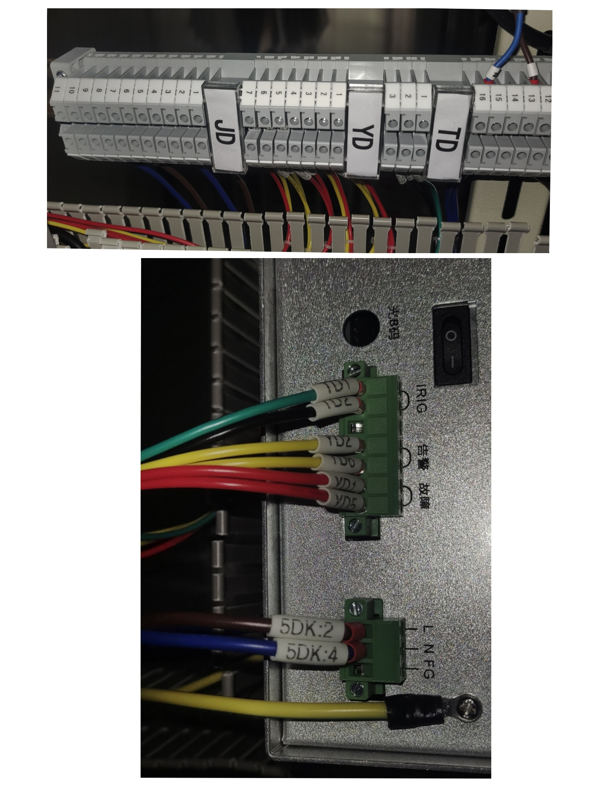

> 马师傅要组的这个屏柜是最难的一个屏，这个一年装不到一次，并没有让我上手。马师傅说让我搞好网分就行了，石老哥还让我后面学习弄弄录波装置，说公司前身就是干这个的。

## 第三周

这周没有学什么新知识，主要发货。后面两天每天装一台 2U，上午就完成。下午无事，一个人剪了不少短线预备做电源用。

第一天收尾，继续装周五留下的屏，上次电源线和设备基本安装好完毕，只差后面插线了。下午装完发货。

周三装了新版 2U 网分，注意螺丝和拆卸顺序。小高一个人安装小柜子，里面线多，很烦人。

放标签框。需要剪纸，其中 6DK 比较少，没有了找大姐打印，有的新的二合一的标签需要额外打印。弄完都收拾到一个袋子里。

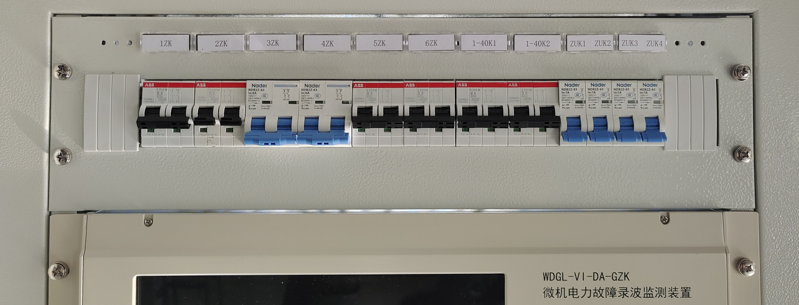

对应图纸

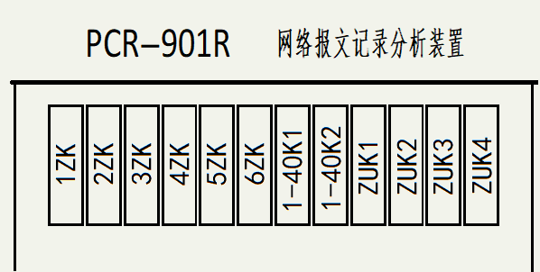

看到最后4个薄的，因为开关也短，两个两个一拼。

【电线的打印】

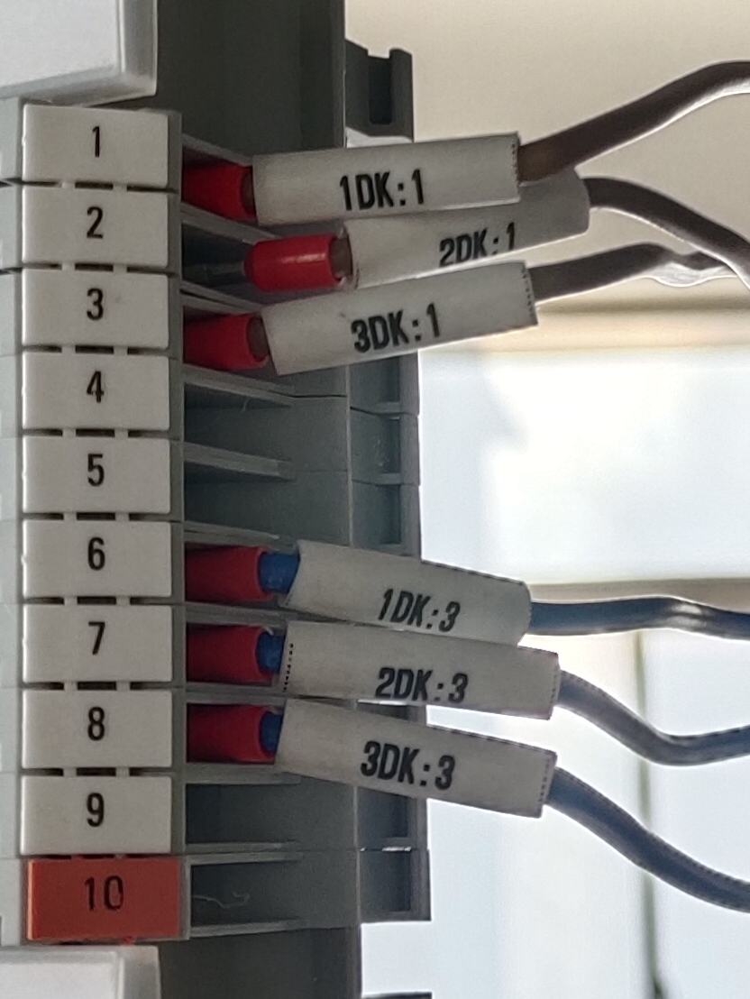

> 看到一个小哥在安装好后的设备里写程序，原来“写”是指传输代码。 FPAG程序用的 vivado 工具。

## 月度总结 Summary

第 2 周没什么事，因为中间几天他们要去苏州考试，要刷题复习，便宜了我。就看着装了 2U采集装置和组屏，主要是开关电源，大屏幕电源多，接线也多。第3周也是，下午接近 3 点就休息了。

月底（2.27）邬老板问我对这个软件熟悉没（了解它用来做什么，有哪些功能），我说已经会装机和组屏了。他说这些不够。他带我见了另一个工程部技术员，结果他说“跟着我没什么用，我也只会这么多”，什么也没有教。
