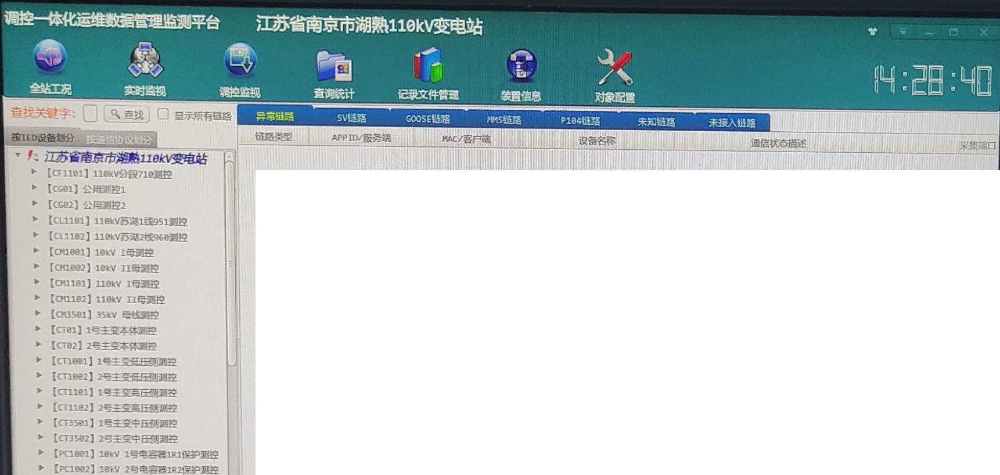

[TOC]

## 概述 Overview

生活日志 [2023年3月](https://ae85.gitee.io/update/journal/202203xhp)

|     T     | 业务安排 | 实际做了什么                     |
| :-------: | -------- | -------------------------------- |
| 3.1 - 3.3 | -        | 发货； 出差江宁胡熟，调控操作 |
| 3.06 - 10 |          |                                  |
| 3.13 - 17 |          |                                  |
| 3.20 - 24 |          |                                  |
| 3.27 - 31 |          |                                  |

## 第一周

组屏到发货3天。后面出差两天。

3.1 上午大家测试电源和显示屏问题，疑似控制部分哪里线路不符合要求，以及听一个老哥讲解现场开口时的方法(见 teach_work1.md)。下午发货。

3.2、3.3 去江宁，本来 2 号就行，进去只要搞40分钟左右。结果一次只能有一个团队在里面（只有一张大票），第2天，1点30近，2点40出，其实可以更早，因为胡工要给我们解释一些现象。

现场工作内容：调换开关接线；更新网分QT程序（增加了一个 `调控监视` 功能）；对时（失败）；上传新 SCD 文件。这个站是老站翻新，没有 SAV协议，只需要 Goose 协议。

## 第二周

## 第三周

## 第四周

## 第五周

## 月度总结 Summary

第一次出差，看网分更新。