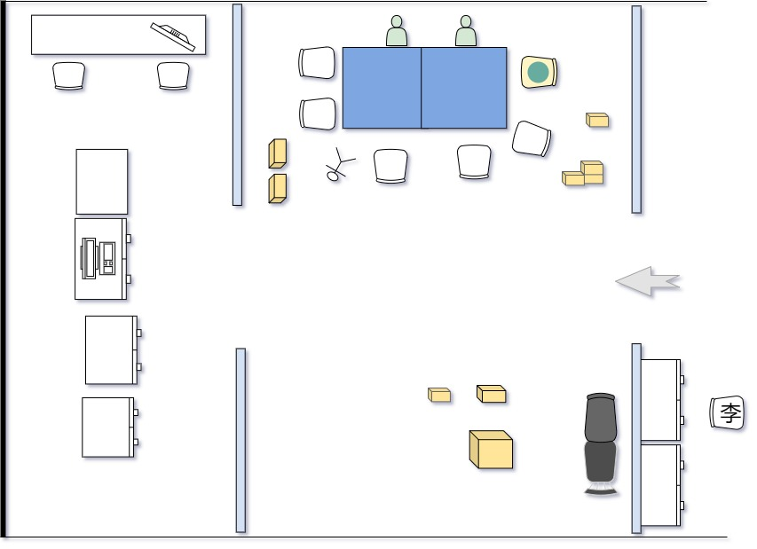

[TOC]

## 概述 Overview

生活日志 [2023年3月](https://ae85.gitee.io/update/journal/202203xhp)

|     T     | 业务安排 | 实际做了什么                     |
| :-------: | -------- | -------------------------------- |
| 3.1 - 3.3 | 出差     | 发货； 出差江宁胡熟，调控操作 |
| 3.06 - 10 | 压板换签 | 组屏，擦胶，装箱                 |
| 3.13 - 17 |          |                                  |
| 3.20 - 24 |          |                                  |
| 3.27 - 31 |          |                                  |

## 第一周

组屏到发货3天。后面出差两天。

3.1 上午大家测试电源和显示屏问题，疑似控制部分哪里线路不符合要求，以及听一个老哥讲解现场开口时的方法(见 teach_work1.md)。下午发货。

3.2、3.3 去江宁，本来 2 号就行，进去只要搞40分钟左右。结果一次只能有一个团队在里面（只有一张大票），第2天，1点30近，2点40出，其实可以更早，因为胡工要给我们解释一些现象。

默认的网分

更新后的网分：

现场工作内容：调换开关接线；更新网分QT程序（增加了一个 `调控监视` 功能）；对时（失败）；上传新 SCD 文件。这个站是老站翻新，没有 SAV协议，只需要 Goose 协议。

## 第二周

周一组屏，用的网分是国产软件，高 4U，不是我们自己装的。

周二上午看更新国产网分，下午发货4台，搬运压板。上午，国产做系统比较麻烦，刘哥电话请教中科骆员工好几次。

和自家网分区别：网口 7、8 是百兆，其余千兆。

① 装 Ubuntu 64；② 自动登录用户用 xhp 还原成 `root` ；③ 添加点灯程序；④ 网口 ip 设置。

**注意** ：点灯程序在 `uzip` 解压后，要 chmod 777 ，然后后面有 `./` ，打错了会导致灯不亮和灯跳不停，要重装系统（一开始以为比较麻烦，因为命令已经写入到控灯硬件中去了）。

周三一天在人事部后面的房间擦胶换盒，大家戏称是 “小作坊”。

上午拆压板传感器的盒子，去黑胶（高工和黄工将面皮用高温器取下来，还有一些黑色的气溶胶残留在壳上）。下午重新包装，一小盒里一张纸、一包零件和一个压板传感器。

周四，上午采集单元重新打包。下午，返工，拆压板盒，和昨日工作一样，贴膜换盒。

周五，发货，两台屏柜和 3 家压板。上午，把昨天剩余的传感器换盒，搬木板和小箱子；下午，传感器装箱、发货。

## 第三周

## 第四周

## 第五周

## 月度总结 Summary

第一次出差，看网分更新。

第 2 周的任务只是因为公司不同引起的，如果出厂时不给传感器装面板就不会耽误这个工夫。