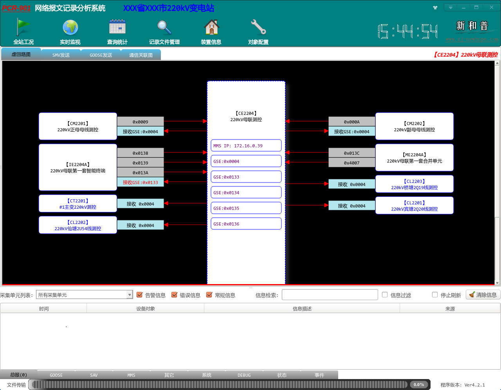
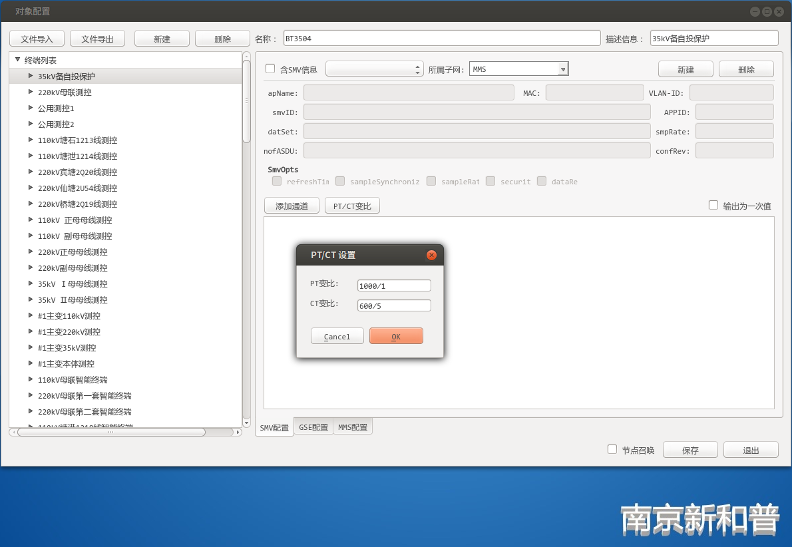

## 胡熟 3.2-3.3

湖熟 3.2-3.3

**前往路线** 坐地铁两小时到。从刘村地铁站到南京南站，转1号线到药科大学站下，做公交车前往；或者转 1 号线后到龙眠大道下，然后坐公交车直接到 湖熟高中站，正好到 变电站旁边的网咖门口，下车后往西走5分钟即到。 

**现场介绍** 在2楼小房间，上楼右拐就是。房间里面放了36个左右的柜子，我们只是其中一个，不起眼。通过看柜头的 “901” 标识找到。胡启h 讲，变电站里的这些柜子（二次设备）其实平时没人用，也不看，所以有的都用布遮着。

### 网分用途

我们的网分放到 substation 就是给人家检查 `SV` 链路和 `GOOSE` 链路。如果有事件发生，网分就会 **记录** 下来，这里的人员就会知道。

变电站员工平时不看其他功能，就看链路图：

# 工作内容

问后台索要 `SCD` 文件 和 变比。在最后一个功能 “对象配置” 里操作。湖熟站比较小，没有 SAV 链路，不需要变比。

> 如果没有 `SAV` ，不用变比。

## Tips

现场调试除了更新网分，还有 通主站 和 装探针 的业务。装探针不要主动去装，先联系 苏yy。

★ 遇到问题，赶紧打电话

网分更新后中文输入失效，【解决方案】重启

对时，找电工确认通电。”我先确定是不是我们的问题“

完事后，跟人家说清楚工作进度，如果有问题怎么联系、联系谁
