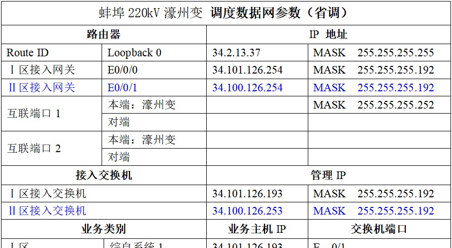
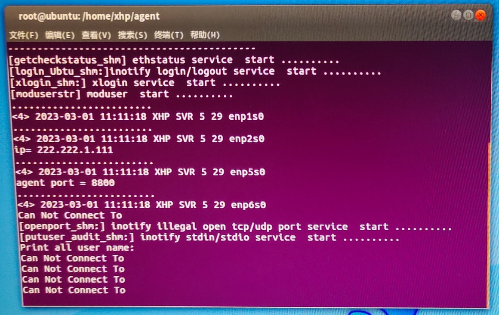

[TOC]

## 先修

1. **子网掩码 (Mask)** 和 `IP` 地址结合，将这个 `IP` 地址划分成网络地址和主机地址两个部分。
2. 192 - 1100 0000 

## 表格介绍

从头 到尾搞一下 20 分钟，打电话两小时。

表中上半部：

我们用 2 区，如果不确定，打个电话问一下。

互联端口1和 2 都不用管，调度数据网。交换机也是 2 区。下半部分是业务类别，直接看 2 区的 **网络分析仪**，一个是 `E 0/8` （8号端口），另一个是 `E 0/10` （10号端口）。 E 表示百兆以太网接口。

## 做探针

在 interface 目录里设置主站的时候加 Gateway。gateway 的设置方法，是 255.255.255.x，看表中路由器栏里 ”2 区接入网关“ 最后面 `MASK` ，这个 `255.255.255.192` 就是 gateway。如果你还不确定的话，可以问一下调度数据网。这个表中安徽的就没有，他们是 `34.10.10.21` ，这个 ip 是不变的，**你不知道你就问一下。**

---

全部弄好，打电话叫给你开口，过 10 分钟 ping 一下，有时候可能你ping不通他但是他 ping 得通你的问题。如果 ping 不通，要去找省调给我们加 102 策略。然后就没有了。

`PS` 实际上 ”通“ 搞熟了从头到尾 20分钟，加上打电话 2 小时。管理单元、实时监视、104链路、IP地址。你要问他 “这是什么资产”，不要问他“什么设备”，资产就是设备的概念。

## 探针开口交涉问题

手机录音，你打第二个电话，他们自动化部门会很不耐烦。

安徽合肥的，给他打电话不给开口子。**要学会利用别人去施压**，你是厂家、后台，他不屌你的，要找现场的项目经理，这个项目经理肯定不好意思，就说“不行的话我先去其他工程，等你这边开口了我再过来”，他肯定不愿意的。

如果别人问“交换机什么模式”，回答“不是我们的”

问“三层两网是什么”，回答“我是网分的厂家，如果这边调度数据网没有调式好，那我跟现场说一下，我先走了。” **强行干活是没有结果的**

